[![Contributors][contributors-shield]][contributors-url]
[![Forks][forks-shield]][forks-url]
[![Stargazers][stars-shield]][stars-url]
[![Issues][issues-shield]][issues-url]
[![MIT License][license-shield]][license-url]
[![LinkedIn][linkedin-shield]][linkedin-url]

# DNS Wrapper Service

DNS Wrapper Service is a versatile tool that enhances DNS functionality by wrapping and forwarding requests based on customized rules. It can seamlessly serve as a recursive DNS Server for specific clients or as a redirector for other clients. By matching incoming DNS requests against tailored configurations, it intelligently redirects queries to external DNS or designated hosts. With DNS Wrapper Service, users can effectively manage and optimize DNS traffic flow, ensuring efficient and secure connections.

## Overall functionality


## Flow daigram


# Building

This project uses cmake. So it should be possible to build this on any system with properly configured CMake and C++ compiler.

## Dependencies

[Boost](https://www.boost.org/) libraries. Specifically following component libraries from boost are used: system, program_options, log, thread, log_setup.

## Linux/UNIX

On Linux following are the build steps:
1. Configure build: `cmake -DCMAKE_BUILD_TYPE=Debug -S. -Bbuild`
2. Build the project: `make -C build`

This will create an executable at the following location: `build/dns-wrapper`

## Windows

The project can be imported in MS Visual Studio as a CMake project. Visual Studio support building, executing and debugging this project.

This will create executable at the following location: `out\build\x64-Debug\dns-wrapper.exe`

Otherwise cmake along with cl compiler can be used to build it on windows. Specifically the following are the build steps:

1. Configure build: 
   ```
     cmake -Bbuild -S. 
        -DCMAKE_CXX_COMPILER=cl
        -DCMAKE_C_COMPILER=cl
        -DCMAKE_BUILD_TYPE:STRING="Debug"
   ```
2. Build the project:`cmake --build build`

# Configuration

`dns-wrapper` supports the following configuraion:

| Option | Type | Default | Required | Description |
| -- | -- | -- | -- | -- |
| logToConsoleAlso | bool | true | No | Confiures service to log to screen along with logging to file. |
| logFile | string | /var/log/dns-wrapper.log (UNIX) | No | Log file to use. |
| | | c:\temp\dns-wrapper.log | | |
| logLevel | string | info | No | Log level (one of the following: trace, debug, info, warning, error, fatal. |
| dnsPort | number | 53 | No | DNS port to use. |
| ruleFile | string | /etc/dns-wrapper/rules.txt | No | Rule configuration file. |
| | | c:\temp\rules.txt | | |
| pidFile | string | /var/run/dns-wrapper.pid | No | PID file (only applicable on UNIX). |
| serverIp1 | string | 1.1.1.1 | No | Primary DNS Server |
| serverPort1 | number | 53 | No | DNS port to be used for Primary DNS Server. |
| protocol1 | string | udp | No | Protocol for primary DNS server (one of the following: udp, tcp). |
| serverIp2 | string | | No | Additional DNS Server |
| serverPort2 | number | 53 | No | DNS port to be used for additional DNS Server. |
| protocol2 | string | udp | No | Protocol for additional DNS server (one of the following: udp, tcp). |
| serverIp3 | string | | No | Additional DNS Server |
| serverPort3 | number | 53 | No | DNS port to be used for additional DNS Server. |
| protocol3 | string | udp | No | Protocol for additional DNS server (one of the following: udp, tcp). |

All configuration options should be present under section `main`.

## Configuration on UNIX

On UNIX the default location for configuration file is: `/etc/dnswrapper/config.ini`. Command line option `--config` can be specified to configure alternate location.

## Configuration on Windows

On Windows configuration can be done using either configuration file specified using command line option `--config` or using Windows registry. If command line option is not specified configuration is read from Windows Registry `HKEY_LOCAL_MACHINE\SOFTWARE\NetDevId\DnsWrapper\main`.

# Running Service

Dns Wrapper Service is can be executed as long running command line utility (on both UNIX and Windows) or as UNIX Daemon or as a Windows Svc Service.
To run it as UNIX daemon or Windows Svc Service command line option `--daemon` needs to be specified.

## Command line execution
To run as command line execute: `./build/dns-wrapper --config-file config/config.ini`

## Running as UNIX daemon
To run as UNIX daemon execute the command: `./build/dns-wrapper --config-file config/config.ini --daemon`

## Running as Windows Svc Service
### Creating Windows Service
To create service execute as (ADMIN user): `sc create dns-wrapper-service DisplayName= "Dns Wrapper Service" binPath= "<path>\dns-wrapper.exe --daemon"`
### Execute the service

Once service is created as per previous step, start Windows services (services.msc) and click on start for `DNS Wrapper Service`.

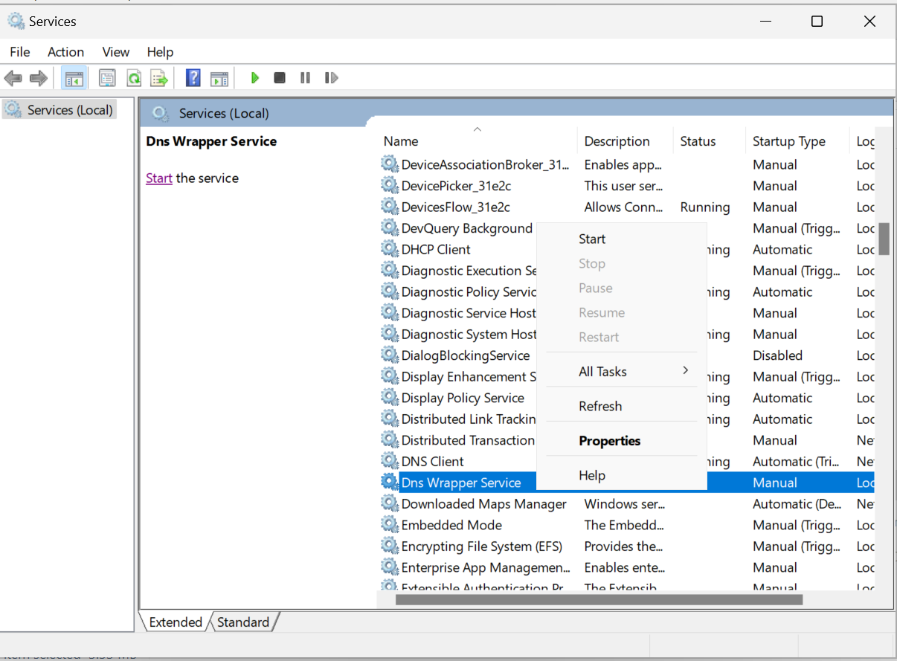

# Running Service and configuring rules

## Starting the daemon service
Starting the daemon service: 
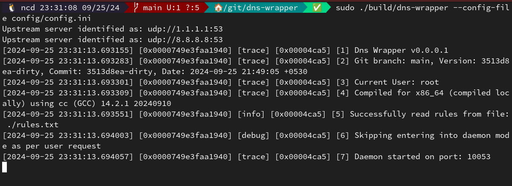

## Help about command line options
Help regarding options can be accessed using --help command line option:

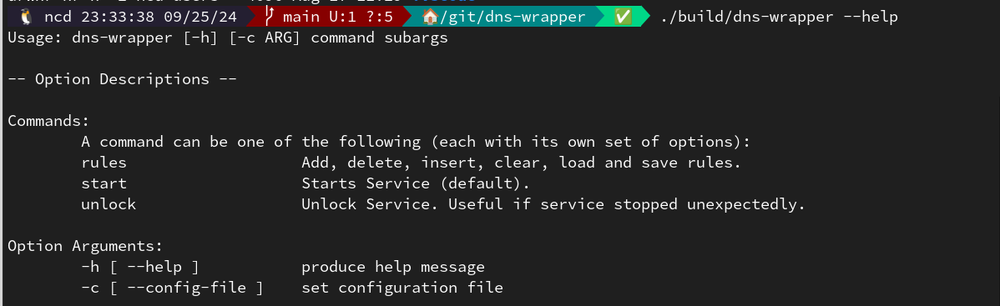

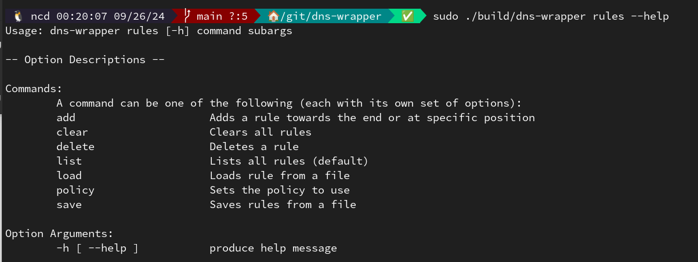

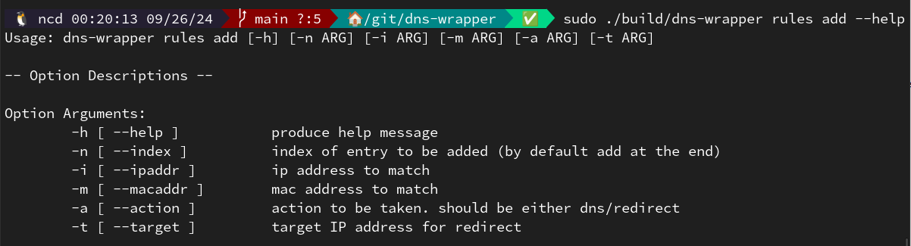

## Listing configured rules and actions

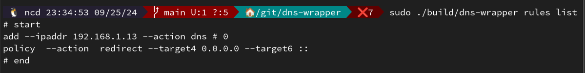

## Clearing configured rules and actions

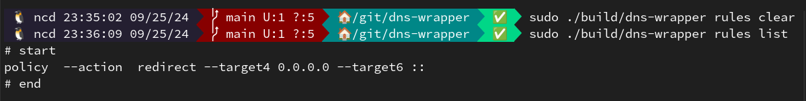

As you can see policy action remains unchanged. There has to be a policy action configured always. You can change it but not delete it altogether

## Dig command with policy set to redirect with no rules

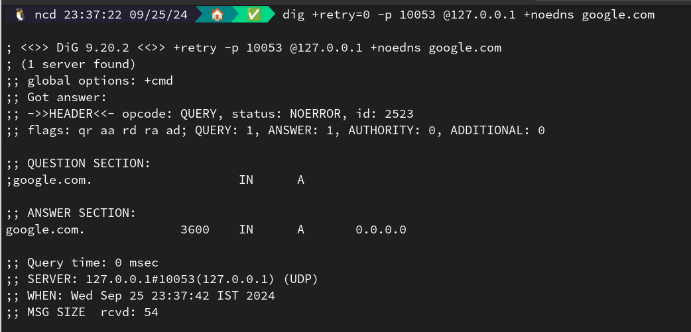

Since there is no rule configured, DNS resolution happens using the configured default policy. For the record configured default policy has target set to 0.0.0.0. It can very well be any other IP address.

## Dig command with rule set to dns for specific IP address

Lets first set a rule as follows:

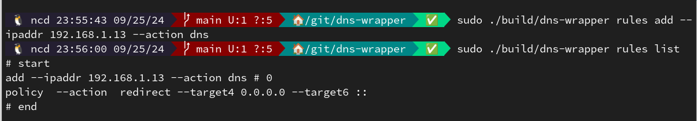

The corresponding dig command output is as follows:

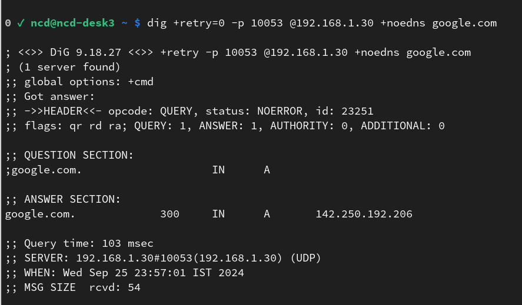

Note the above dig command was executed from IP address 192.168.1.13. Since the rule is set to DNS the DNS query is resolved using the configured DNS.

## Lets delete the rule created above run dig command again

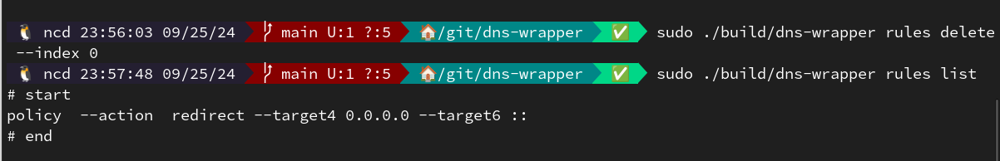

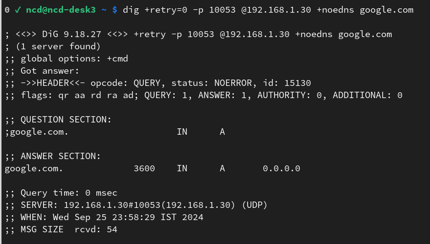

## Dig command with rule set to a specific MAC address

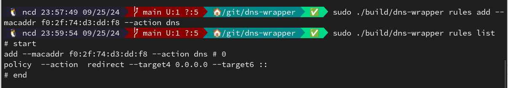

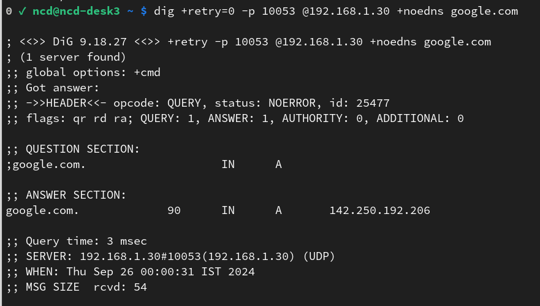

In this case if DNS query comes from the machine with the above MAC address, it is resolved using configured DNS. For DNS query coming from any other client, the default policy kicks in.

## Dig command with rule set to a specific IP and MAC address

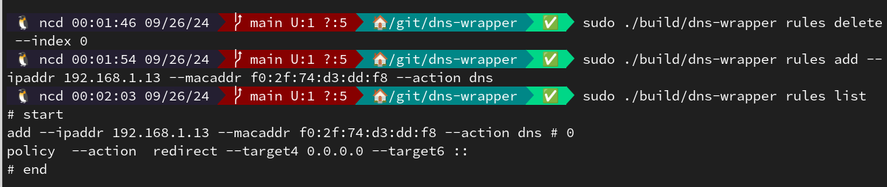

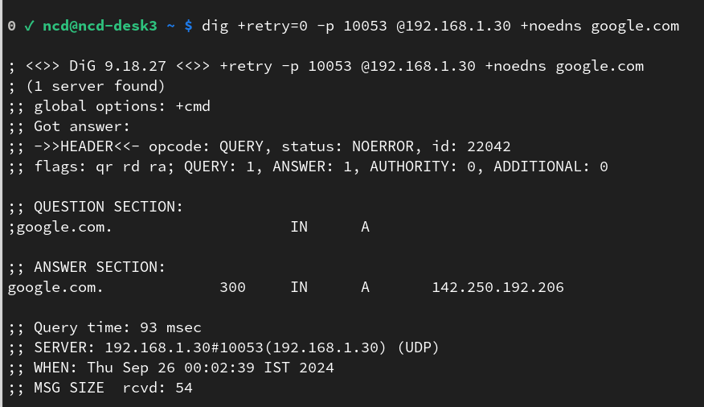

Both IP address and MAC address must match from that of incoming DNS query for rule to come into effect.

## You can configure as many rules as you want (within an upper bound as defined in code)

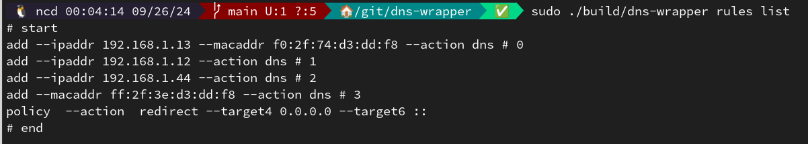

## Saving rules and policy to a file

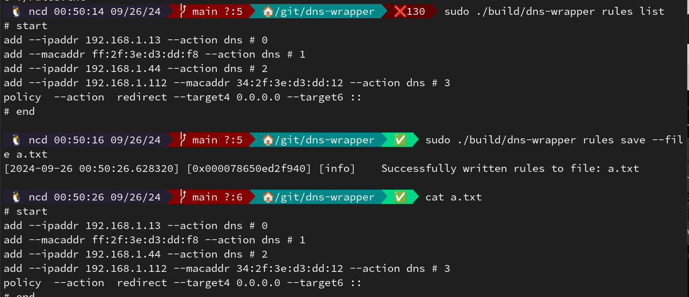

These saved rules and policy can be loaded at any time using the load subcommand. Further the corresponding config file parameter can be configured to load rules at service startup.

# Testing Service

## UNIX

On UNIX execute the command: `dig +retry=0 @127.0.0.1 +noedns google.com`

```bash
; <<>> DiG 9.20.1 <<>> +retry -p 10053 @127.0.0.1 +noedns google.com
; (1 server found)
;; global options: +cmd
;; Got answer:
;; ->>HEADER<<- opcode: QUERY, status: NOERROR, id: 44976
;; flags: qr rd ra; QUERY: 1, ANSWER: 1, AUTHORITY: 0, ADDITIONAL: 0

;; QUESTION SECTION:
;google.com.			IN	A

;; ANSWER SECTION:
google.com.		300	IN	A	142.250.194.46

;; Query time: 100 msec
;; SERVER: 127.0.0.1#10053(127.0.0.1) (UDP)
;; WHEN: Wed Sep 11 18:15:26 IST 2024
;; MSG SIZE  rcvd: 54
```

## Windows

On Powershell execute the command: `Resolve-DnsName -Name google.com -server localhost`
```bash
Name                                           Type   TTL   Section    IPAddress
----                                           ----   ---   -------    ---------
google.com                                     A      275   Answer     142.250.194.46
```

<!-- MARKDOWN LINKS & IMAGES -->
<!-- https://www.markdownguide.org/basic-syntax/#reference-style-links -->
[contributors-shield]: https://img.shields.io/github/contributors/net-dev-id/dns-wrapper.svg?style=for-the-badge
[contributors-url]: https://github.com/net-dev-id/dns-wrapper/graphs/contributors
[forks-shield]: https://img.shields.io/github/forks/net-dev-id/dns-wrapper.svg?style=for-the-badge
[forks-url]: https://github.com/net-dev-id/dns-wrapper/network/members
[stars-shield]: https://img.shields.io/github/stars/net-dev-id/dns-wrapper.svg?style=for-the-badge
[stars-url]: https://github.com/net-dev-id/dns-wrapper/stargazers
[issues-shield]: https://img.shields.io/github/issues/net-dev-id/dns-wrapper.svg?style=for-the-badge
[issues-url]: https://github.com/net-dev-id/dns-wrapper/issues
[license-shield]: https://img.shields.io/github/license/net-dev-id/dns-wrapper.svg?style=for-the-badge
[license-url]: https://github.com/net-dev-id/dns-wrapper/blob/master/LICENSE
[linkedin-shield]: https://img.shields.io/badge/-LinkedIn-black.svg?style=for-the-badge&logo=linkedin&colorB=555
[linkedin-url]: https://linkedin.com/in/neeraj-jakhar-39686212b

